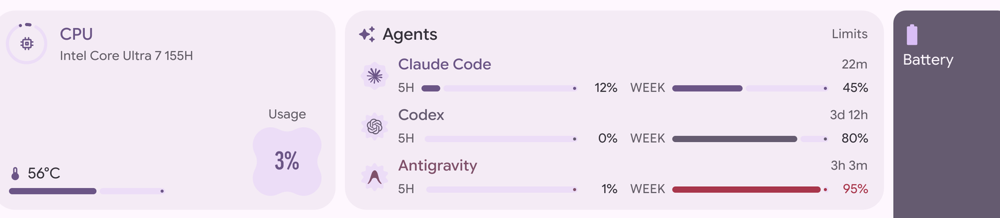

# AgentUsage

Five-hour and weekly usage limits for the coding agents on this machine, as a
card in the Caelestia dashboard's Performance tab.



Every agent bills against the same two rolling windows — a short one and a
week — so all three get the same pair of gauges, sitting beside a blob that
swells as the agent gets used up, the way the CPU card's usage blob does.

| Agent | Where the reading comes from |
|---|---|
| Claude Code | The usage endpoint, asked with the OAuth credentials Claude Code already stores in `~/.claude/.credentials.json`. |
| Codex | The `rate_limits` record the server returns with every response, as written into the newest session log under `~/.codex/sessions`. |
| Antigravity | `agy -p /usage`, which answers the CLI's read-only slash commands in print mode without spending a turn. |

An agent that is not installed, not signed in, or has never been run says so
instead of drawing an empty gauge — nothing here reports 0% for "no idea".

Codex only learns its limits while it is running, so its reading is as old as
its last session. Where a window's own reset time has passed since then, the
window is reported as empty rather than as whatever it was when Codex last
looked.

## Requires

A shell carrying Caelestia's plugin loader, and a Performance tab that renders
`custom` entry points asking for the `performance` slot:

```qml
Repeater {
    model: Plugins.entryPoints(EntryPointType.Custom).filter(e => e.properties.slot === "performance")

    EntryPointLoader {
        required property var modelData

        Layout.fillWidth: true
        Layout.fillHeight: true

        entryPoint: modelData
    }
}
```

Both live in [kagami-caelestia](https://github.com/dcqwqc/kagami-caelestia).
The hero cards there give up their stretch while a plugin holds that slot, so
the CPU card's usage blob stays beside the CPU readout instead of being pushed
to the far right of the row.

`python3` for the collector, and `agy` on PATH for the Antigravity row. No
other dependencies.

## Install

```sh
git clone https://github.com/dcqwqc/caelestia-plugin-agent-usage \
    ~/.local/share/caelestia/plugins/agent-usage
```

Then enable `dcqwqc/agentusage` on the Plugins page.

## Settings

| Setting | Default | |
|---|---|---|
| Refresh interval | 120s | Claude Code is asked over the network, the rest is read off disk. |
| Show Claude Code / Codex / Antigravity | on | Hides a row entirely. |
| Antigravity limit pool | worst | `worst`, `gemini` or `claude-gpt` — see below. |

The collector caches to `$XDG_RUNTIME_DIR/caelestia-agent-usage.json` for half
the refresh interval, so several shells on one machine do not each go asking.

## Antigravity

`agy` reports what is **left**, not what is spent, and it bills Gemini apart
from the Claude and GPT models it can also drive — so there is no single
number for it:

```
Gemini Models            Weekly Limit Remaining      5%    2026-09-23T12:14:00Z
Gemini Models            Five Hour Limit Remaining  99%    2026-09-21T20:41:22Z
Claude and GPT models    Weekly Limit Remaining     66%    2026-09-27T19:48:19Z
Claude and GPT models    Five Hour Limit Remaining 100%    2026-09-21T22:37:26Z
```

The row shows whichever pool is nearest its limit, per window, because that is
the one that will stop you first. Pin it to one pool in the settings instead.

Asking costs about 2.5s of process startup, so the cache matters here more than
for the others.

## Marks

The three marks are drawn as single filled paths so they take the palette like
any other icon. Claude's and OpenAI's are from
[simple-icons](https://github.com/simple-icons/simple-icons) (CC0);
Antigravity's is from [Papirus](https://github.com/PapirusDevelopmentTeam/papirus-icon-theme)
(GPL-3.0), flattened to its silhouette. Each is a trademark of its owner and is
used here only to label that owner's own service.

## Licence

GPL-3.0.
